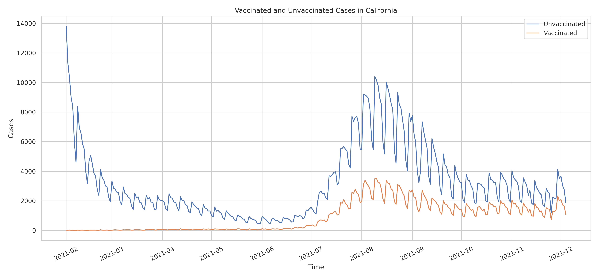
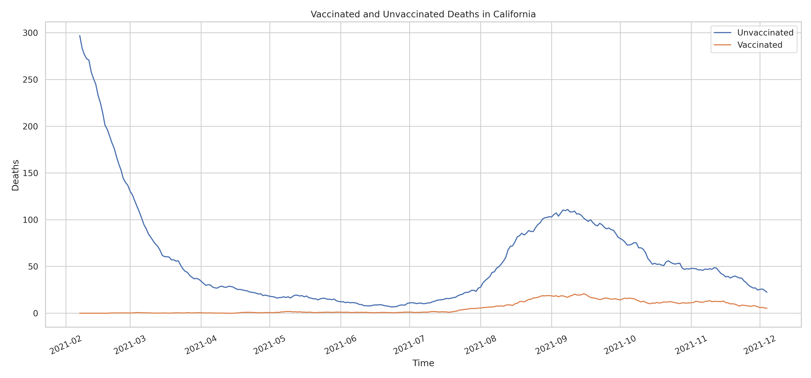

# California COVID Breakthrough Information

A recent article posed the question of why Florida wouldn't release information on trends for vaccinated versus unvaccinated cases and why Florida has gone from one of the most transparent states to one of the most opaque states in terms of tracking and releasing Covid information.
https://www.tampabay.com/news/health/2021/12/22/why-wont-florida-cdc-release-states-breakthrough-covid-data/

In this article, it is also mentioned that the state of Florida had issued a statement saying that one third of their cases were breakthrough cases. This is typically an attempt to downplay the effectiveness of the vaccine in terms of public health while continuing to withold information that would substantiate their claim. While Florida won't release their information we can take a look at how other states are faring to get a picture of what might be going on within Florida. 

California is one state that is tracking vaccinated versus unvaccinated case information so we can take a look at the information from California and attempt to draw some sort of parrellel between the two. The information for California is available here ...
https://data.chhs.ca.gov/dataset/covid-19-post-vaccination-infection-data

Based on this information, we can see that California is close to being in the same situation as Florida where roughly one third of their covid cases are breakthrough cases but based on the data we can see that this is only because the total number of cases have dropped significantly over the past several months and while the unvaccinated cases have dropped significantly, the vaccinated cases have remained somewhat constant. The fact that the vaccinated cases have remained somewhat stagnant could be caused by a lack of booster shots. Unfortunately, booster shot information is not currently being tracked.

